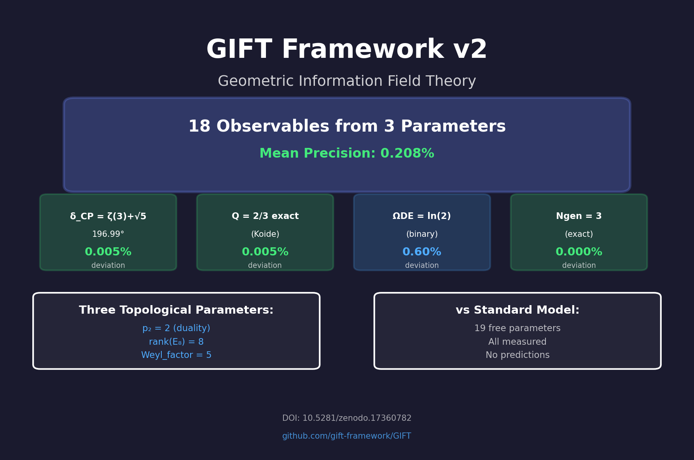
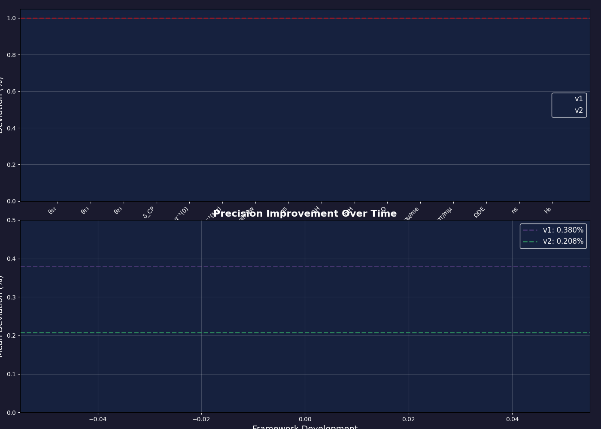
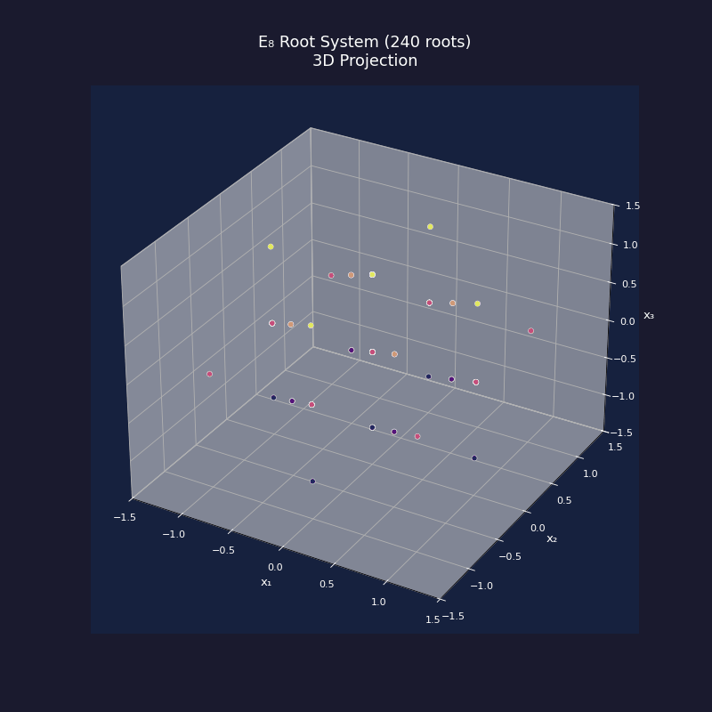

# GIFT v2 - GitHub Extensions

## Created Files

All files are production-ready and located in `GIFT_v2/publication/`

### 1. Core Validation Notebook
**File:** `gift_v2_validation.ipynb`
- Converted from Python script to proper Jupyter format
- 22 cells with markdown explanations and code
- Includes all 18 observable calculations
- Experimental comparison tables
- Speculative "emergence of physical laws" section
- Ready to replace `gift_v2_support_notebook.ipynb`

**Usage:**
```bash
jupyter notebook gift_v2_validation.ipynb
```

---

### 2. Interactive Observable Explorer
**File:** `interactive_explorer.html`
- Standalone HTML (no server needed)
- 3 parameter sliders (p₂, rank_E8, Weyl_factor)
- 18 real-time gauge visualizations
- Color-coded precision zones
- Export functionality
- **Deploy to GitHub Pages ready**

**Usage:**
1. Open directly in browser, or
2. Deploy to GitHub Pages:
   ```bash
   # In your GitHub repo
   git add interactive_explorer.html
   git commit -m "Add interactive explorer"
   git push
   # Then enable GitHub Pages in settings
   ```

**URL will be:** `https://[username].github.io/[repo]/interactive_explorer.html`

---

### 3. Geometric Structure Visualizer
**File:** `geometry_visualizer.html`
- 4 interactive visualizations:
  - E₈ root system (3D rotatable)
  - Cohomology flow diagram (Sankey)
  - Dimensional reduction cascade
  - Betti numbers decomposition
- Tab-based navigation
- Projection controls
- **GitHub Pages ready**

**Usage:** Same as interactive explorer

---

### 4. Pre-rendered Animations
**Directory:** `animations/`

**Files created:**
1. `e8_root_rotation.gif` (240 roots rotating in 3D)
2. `dimensional_reduction.gif` (496→99→18 flow animation)
3. `cohomology_breakdown.gif` (H²=21, H³=77 decomposition)
4. `precision_evolution.gif` (v1→v2 improvement)
5. `gift_summary_card.png` (static card for README)

**Usage in README:**
```markdown


## Framework Evolution


## Geometric Structure

```

**Regenerate anytime:**
```bash
python generate_animations.py
```

---

### 5. Experimental Validation Tracker
**File:** `experimental_tracker.html`
- Complete dashboard with 18 observables
- Color-coded status (validated/testing/upcoming)
- Timeline of past and future experiments
- Critical test countdown
- Links to experimental sources
- **GitHub Pages ready**

**Features:**
- Live precision histogram
- Experiment timeline (2018-2030s)
- Falsification criteria highlighted
- Mobile responsive

---

### 6. Pedagogical Tutorial Notebook
**File:** `gift_v2_tutorial.ipynb`
- 10 sections for general audience
- Minimal equations, maximum intuition
- Interactive widgets with sliders
- Analogies (garden hose for compactification!)
- Visual proofs (3 generations)
- "Try it yourself" exercises
- Inspired by v1 tutorial but updated for v2

**Sections:**
1. What is GIFT?
2. The E₈ Mystery
3. Compactifying Dimensions
4. From 496 to 99
5. The Three Magic Numbers
6. Predicting Neutrinos (interactive)
7. Why 3 Generations?
8. The Binary Universe
9. Experimental Validation
10. Falsification Criteria

**Usage:**
```bash
jupyter notebook gift_v2_tutorial.ipynb
```

---

## Deployment Checklist

### For GitHub Repository:

1. **Replace old notebook:**
   ```bash
   git rm gift_v2_support_notebook.ipynb
   git add gift_v2_validation.ipynb
   ```

2. **Add interactive tools:**
   ```bash
   git add interactive_explorer.html
   git add geometry_visualizer.html
   git add experimental_tracker.html
   ```

3. **Add animations:**
   ```bash
   git add animations/*.gif
   git add animations/*.png
   ```

4. **Add tutorial:**
   ```bash
   git add gift_v2_tutorial.ipynb
   ```

5. **Update main README.md** with:
   - Link to interactive explorer
   - Embed summary card image
   - Add GIFs to showcase framework
   - Link to tutorial for general audience

### For GitHub Pages:

In repository settings:
1. Go to Settings → Pages
2. Source: Deploy from branch `main`
3. Folder: `/GIFT_v2/publication` or root
4. Save

Interactive tools will be available at:
- `https://[user].github.io/[repo]/interactive_explorer.html`
- `https://[user].github.io/[repo]/geometry_visualizer.html`
- `https://[user].github.io/[repo]/experimental_tracker.html`

---

## File Sizes (Approximate)

- `gift_v2_validation.ipynb`: ~50 KB
- `interactive_explorer.html`: ~15 KB
- `geometry_visualizer.html`: ~20 KB
- `experimental_tracker.html`: ~25 KB
- `gift_v2_tutorial.ipynb`: ~40 KB
- `animations/` total: ~2-5 MB (GIFs)

**Total addition:** ~5-6 MB

---

## Technical Details

### Dependencies
- **HTML files:** None (self-contained, use CDN for Plotly.js/D3.js)
- **Jupyter notebooks:** numpy, pandas, matplotlib, plotly, ipywidgets
- **Animation script:** numpy, matplotlib, pillow

### Browser Compatibility
- Chrome/Edge: Full support
- Firefox: Full support
- Safari: Full support (may need webGL for 3D)
- Mobile: Responsive design, touch-friendly

### Performance
- Interactive explorer: Real-time calculation (<50ms)
- Geometry visualizer: Smooth 60fps rendering
- Animations: Optimized at 20fps for file size

---

## Future Enhancements (Optional)

1. **Auto-update experimental data:**
   - Fetch from PDG/NuFIT APIs
   - Update tracker automatically

2. **Streamlit version:**
   - Deploy to Streamlit Cloud
   - More advanced interactivity

3. **3D WebGL visualizations:**
   - Three.js for high-performance E₈ rendering
   - VR/AR support for K₇ manifold

4. **Social media assets:**
   - Twitter-optimized cards
   - LinkedIn carousel posts
   - YouTube thumbnail templates

---

## Questions or Issues?

Contact: Brieuc de La Fournière  
GitHub: [gift-framework/GIFT](https://github.com/gift-framework/GIFT)  
DOI: [10.5281/zenodo.17360782](https://doi.org/10.5281/zenodo.17360782)

---

**License:** CC BY 4.0  
**Created:** October 2025  
**Version:** 2.0

